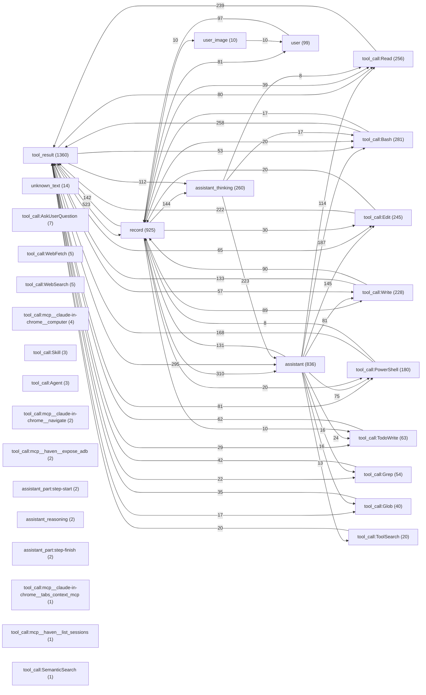

# D001 trajectory behavior graph

```mermaid
flowchart LR
    n_tool_result["tool_result (1360)"]
    n_record["record (925)"]
    n_assistant["assistant (836)"]
    n_tool_call_Bash["tool_call:Bash (281)"]
    n_assistant_thinking["assistant_thinking (260)"]
    n_tool_call_Read["tool_call:Read (256)"]
    n_tool_call_Edit["tool_call:Edit (245)"]
    n_tool_call_Write["tool_call:Write (228)"]
    n_tool_call_PowerShell["tool_call:PowerShell (180)"]
    n_user["user (99)"]
    n_tool_call_TodoWrite["tool_call:TodoWrite (63)"]
    n_tool_call_Grep["tool_call:Grep (54)"]
    n_tool_call_Glob["tool_call:Glob (40)"]
    n_tool_call_ToolSearch["tool_call:ToolSearch (20)"]
    n_unknown_text["unknown_text (14)"]
    n_user_image["user_image (10)"]
    n_tool_call_AskUserQuestion["tool_call:AskUserQuestion (7)"]
    n_tool_call_WebFetch["tool_call:WebFetch (5)"]
    n_tool_call_WebSearch["tool_call:WebSearch (5)"]
    n_tool_call_mcp__claude_in_chrome__computer["tool_call:mcp__claude-in-chrome__computer (4)"]
    n_tool_call_Skill["tool_call:Skill (3)"]
    n_tool_call_Agent["tool_call:Agent (3)"]
    n_tool_call_mcp__claude_in_chrome__navigate["tool_call:mcp__claude-in-chrome__navigate (2)"]
    n_tool_call_mcp__haven__expose_adb["tool_call:mcp__haven__expose_adb (2)"]
    n_assistant_part_step_start["assistant_part:step-start (2)"]
    n_assistant_reasoning["assistant_reasoning (2)"]
    n_assistant_part_step_finish["assistant_part:step-finish (2)"]
    n_tool_call_mcp__claude_in_chrome__tabs_context_mcp["tool_call:mcp__claude-in-chrome__tabs_context_mcp (1)"]
    n_tool_call_mcp__haven__list_sessions["tool_call:mcp__haven__list_sessions (1)"]
    n_tool_call_SemanticSearch["tool_call:SemanticSearch (1)"]
    n_tool_result -->|523| n_record
    n_record -->|310| n_assistant
    n_tool_result -->|295| n_assistant
    n_tool_call_Bash -->|258| n_tool_result
    n_tool_call_Read -->|239| n_tool_result
    n_assistant_thinking -->|223| n_assistant
    n_tool_call_Edit -->|222| n_tool_result
    n_assistant -->|187| n_tool_call_Bash
    n_tool_call_PowerShell -->|168| n_tool_result
    n_assistant -->|145| n_tool_call_Edit
    n_record -->|144| n_assistant_thinking
    n_record -->|142| n_tool_result
    n_tool_call_Write -->|133| n_tool_result
    n_assistant -->|131| n_record
    n_assistant -->|114| n_tool_call_Read
    n_tool_result -->|112| n_assistant_thinking
    n_user -->|97| n_record
    n_tool_call_Write -->|90| n_record
    n_record -->|89| n_tool_call_Write
    n_record -->|81| n_user
    n_assistant -->|81| n_tool_call_Write
    n_tool_result -->|81| n_tool_call_PowerShell
    n_tool_result -->|80| n_tool_call_Read
    n_assistant -->|75| n_tool_call_PowerShell
    n_tool_result -->|65| n_tool_call_Edit
    n_tool_call_TodoWrite -->|62| n_tool_result
    n_tool_result -->|57| n_tool_call_Write
    n_tool_result -->|53| n_tool_call_Bash
    n_tool_call_Grep -->|42| n_tool_result
    n_record -->|39| n_tool_call_Read
    n_tool_call_Glob -->|35| n_tool_result
    n_record -->|30| n_tool_call_Edit
    n_tool_result -->|29| n_tool_call_TodoWrite
    n_assistant -->|24| n_tool_call_TodoWrite
    n_tool_result -->|22| n_tool_call_Grep
    n_tool_call_ToolSearch -->|20| n_tool_result
    n_record -->|20| n_tool_call_PowerShell
    n_tool_call_Edit -->|20| n_record
    n_record -->|20| n_tool_call_Bash
    n_tool_result -->|17| n_tool_call_Glob
    n_assistant_thinking -->|17| n_tool_call_Bash
    n_tool_call_Bash -->|17| n_record
    n_assistant -->|16| n_tool_call_Grep
    n_assistant -->|16| n_tool_call_Glob
    n_assistant -->|13| n_tool_call_ToolSearch
    n_record -->|10| n_tool_call_TodoWrite
    n_record -->|10| n_user_image
    n_user_image -->|10| n_user
    n_tool_call_PowerShell -->|8| n_record
    n_assistant_thinking -->|8| n_tool_call_Read
```

Slices: 65
Unique signatures: 64
