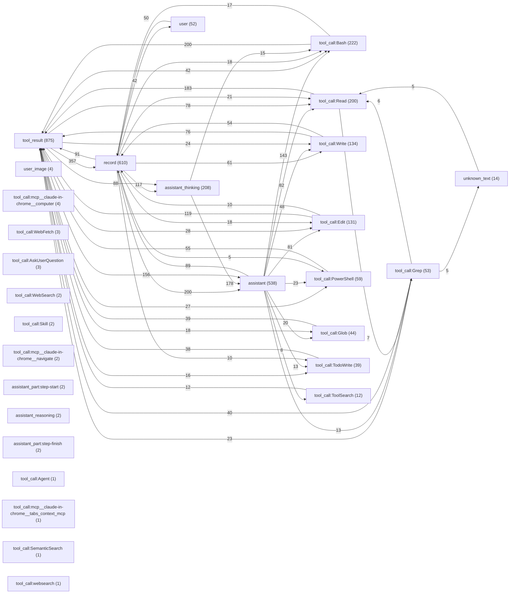

# D002 trajectory behavior graph

```mermaid
flowchart LR
    n_tool_result["tool_result (875)"]
    n_record["record (610)"]
    n_assistant["assistant (538)"]
    n_tool_call_Bash["tool_call:Bash (222)"]
    n_assistant_thinking["assistant_thinking (208)"]
    n_tool_call_Read["tool_call:Read (200)"]
    n_tool_call_Write["tool_call:Write (134)"]
    n_tool_call_Edit["tool_call:Edit (131)"]
    n_tool_call_PowerShell["tool_call:PowerShell (59)"]
    n_tool_call_Grep["tool_call:Grep (53)"]
    n_user["user (52)"]
    n_tool_call_Glob["tool_call:Glob (44)"]
    n_tool_call_TodoWrite["tool_call:TodoWrite (39)"]
    n_unknown_text["unknown_text (14)"]
    n_tool_call_ToolSearch["tool_call:ToolSearch (12)"]
    n_user_image["user_image (4)"]
    n_tool_call_mcp__claude_in_chrome__computer["tool_call:mcp__claude-in-chrome__computer (4)"]
    n_tool_call_WebFetch["tool_call:WebFetch (3)"]
    n_tool_call_AskUserQuestion["tool_call:AskUserQuestion (3)"]
    n_tool_call_WebSearch["tool_call:WebSearch (2)"]
    n_tool_call_Skill["tool_call:Skill (2)"]
    n_tool_call_mcp__claude_in_chrome__navigate["tool_call:mcp__claude-in-chrome__navigate (2)"]
    n_assistant_part_step_start["assistant_part:step-start (2)"]
    n_assistant_reasoning["assistant_reasoning (2)"]
    n_assistant_part_step_finish["assistant_part:step-finish (2)"]
    n_tool_call_Agent["tool_call:Agent (1)"]
    n_tool_call_mcp__claude_in_chrome__tabs_context_mcp["tool_call:mcp__claude-in-chrome__tabs_context_mcp (1)"]
    n_tool_call_SemanticSearch["tool_call:SemanticSearch (1)"]
    n_tool_call_websearch["tool_call:websearch (1)"]
    n_tool_result -->|357| n_record
    n_record -->|200| n_assistant
    n_tool_call_Bash -->|200| n_tool_result
    n_tool_call_Read -->|183| n_tool_result
    n_assistant_thinking -->|178| n_assistant
    n_tool_result -->|156| n_assistant
    n_assistant -->|143| n_tool_call_Bash
    n_tool_call_Edit -->|119| n_tool_result
    n_record -->|117| n_assistant_thinking
    n_record -->|91| n_tool_result
    n_assistant -->|89| n_record
    n_tool_result -->|88| n_assistant_thinking
    n_assistant -->|82| n_tool_call_Read
    n_assistant -->|81| n_tool_call_Edit
    n_tool_result -->|78| n_tool_call_Read
    n_tool_call_Write -->|76| n_tool_result
    n_record -->|61| n_tool_call_Write
    n_tool_call_PowerShell -->|55| n_tool_result
    n_tool_call_Write -->|54| n_record
    n_user -->|50| n_record
    n_assistant -->|48| n_tool_call_Write
    n_record -->|42| n_user
    n_tool_result -->|42| n_tool_call_Bash
    n_tool_call_Grep -->|40| n_tool_result
    n_tool_call_Glob -->|39| n_tool_result
    n_tool_call_TodoWrite -->|38| n_tool_result
    n_tool_result -->|28| n_tool_call_Edit
    n_tool_result -->|27| n_tool_call_PowerShell
    n_tool_result -->|24| n_tool_call_Write
    n_tool_result -->|23| n_tool_call_Grep
    n_assistant -->|23| n_tool_call_PowerShell
    n_record -->|21| n_tool_call_Read
    n_assistant -->|20| n_tool_call_Glob
    n_tool_result -->|18| n_tool_call_Glob
    n_record -->|18| n_tool_call_Edit
    n_record -->|18| n_tool_call_Bash
    n_tool_call_Bash -->|17| n_record
    n_tool_result -->|16| n_tool_call_TodoWrite
    n_assistant_thinking -->|15| n_tool_call_Bash
    n_assistant -->|13| n_tool_call_TodoWrite
    n_assistant -->|13| n_tool_call_Grep
    n_tool_call_ToolSearch -->|12| n_tool_result
    n_record -->|10| n_tool_call_TodoWrite
    n_tool_call_Edit -->|10| n_record
    n_assistant -->|8| n_tool_call_ToolSearch
    n_tool_call_Read -->|7| n_tool_call_Grep
    n_tool_call_Grep -->|6| n_tool_call_Read
    n_record -->|5| n_tool_call_PowerShell
    n_unknown_text -->|5| n_tool_call_Read
    n_tool_call_Grep -->|5| n_unknown_text
```

Slices: 43
Unique signatures: 43
