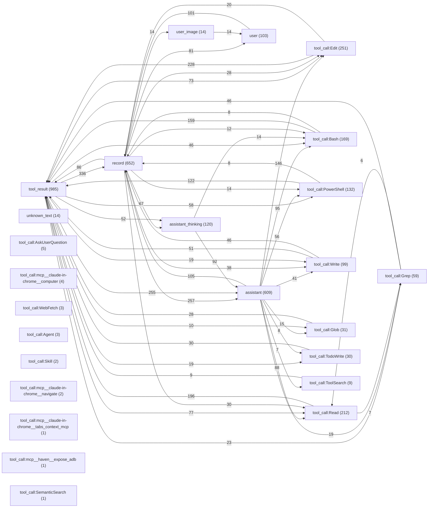

# D003 trajectory behavior graph

```mermaid
flowchart LR
    n_tool_result["tool_result (985)"]
    n_record["record (652)"]
    n_assistant["assistant (609)"]
    n_tool_call_Edit["tool_call:Edit (251)"]
    n_tool_call_Read["tool_call:Read (212)"]
    n_tool_call_Bash["tool_call:Bash (169)"]
    n_tool_call_PowerShell["tool_call:PowerShell (132)"]
    n_assistant_thinking["assistant_thinking (120)"]
    n_user["user (103)"]
    n_tool_call_Write["tool_call:Write (99)"]
    n_tool_call_Grep["tool_call:Grep (59)"]
    n_tool_call_Glob["tool_call:Glob (31)"]
    n_tool_call_TodoWrite["tool_call:TodoWrite (30)"]
    n_user_image["user_image (14)"]
    n_unknown_text["unknown_text (14)"]
    n_tool_call_ToolSearch["tool_call:ToolSearch (9)"]
    n_tool_call_AskUserQuestion["tool_call:AskUserQuestion (5)"]
    n_tool_call_mcp__claude_in_chrome__computer["tool_call:mcp__claude-in-chrome__computer (4)"]
    n_tool_call_WebFetch["tool_call:WebFetch (3)"]
    n_tool_call_Agent["tool_call:Agent (3)"]
    n_tool_call_Skill["tool_call:Skill (2)"]
    n_tool_call_mcp__claude_in_chrome__navigate["tool_call:mcp__claude-in-chrome__navigate (2)"]
    n_tool_call_mcp__claude_in_chrome__tabs_context_mcp["tool_call:mcp__claude-in-chrome__tabs_context_mcp (1)"]
    n_tool_call_mcp__haven__expose_adb["tool_call:mcp__haven__expose_adb (1)"]
    n_tool_call_SemanticSearch["tool_call:SemanticSearch (1)"]
    n_tool_result -->|336| n_record
    n_record -->|257| n_assistant
    n_tool_result -->|255| n_assistant
    n_tool_call_Edit -->|228| n_tool_result
    n_tool_call_Read -->|196| n_tool_result
    n_tool_call_Bash -->|159| n_tool_result
    n_assistant -->|146| n_tool_call_Edit
    n_tool_call_PowerShell -->|122| n_tool_result
    n_assistant -->|105| n_record
    n_user -->|101| n_record
    n_assistant -->|95| n_tool_call_Bash
    n_assistant_thinking -->|92| n_assistant
    n_assistant -->|88| n_tool_call_Read
    n_record -->|86| n_tool_result
    n_record -->|81| n_user
    n_tool_result -->|77| n_tool_call_Read
    n_tool_result -->|73| n_tool_call_Edit
    n_record -->|67| n_assistant_thinking
    n_tool_result -->|58| n_tool_call_PowerShell
    n_assistant -->|56| n_tool_call_PowerShell
    n_tool_result -->|52| n_assistant_thinking
    n_tool_call_Write -->|51| n_tool_result
    n_tool_call_Grep -->|46| n_tool_result
    n_tool_call_Write -->|46| n_record
    n_tool_result -->|46| n_tool_call_Bash
    n_assistant -->|41| n_tool_call_Write
    n_record -->|38| n_tool_call_Write
    n_record -->|30| n_tool_call_Read
    n_tool_call_TodoWrite -->|30| n_tool_result
    n_tool_call_Glob -->|28| n_tool_result
    n_record -->|28| n_tool_call_Edit
    n_tool_result -->|23| n_tool_call_Grep
    n_tool_call_Edit -->|20| n_record
    n_assistant -->|19| n_tool_call_Grep
    n_tool_result -->|19| n_tool_call_Write
    n_tool_result -->|19| n_tool_call_TodoWrite
    n_assistant -->|15| n_tool_call_Glob
    n_record -->|14| n_user_image
    n_user_image -->|14| n_user
    n_record -->|14| n_tool_call_PowerShell
    n_assistant_thinking -->|14| n_tool_call_Bash
    n_record -->|12| n_tool_call_Bash
    n_tool_result -->|10| n_tool_call_Glob
    n_tool_call_ToolSearch -->|9| n_tool_result
    n_assistant -->|8| n_tool_call_TodoWrite
    n_tool_call_PowerShell -->|8| n_record
    n_tool_call_Bash -->|8| n_record
    n_assistant -->|7| n_tool_call_ToolSearch
    n_tool_call_Read -->|7| n_tool_call_Grep
    n_tool_call_Grep -->|6| n_tool_call_Read
```

Slices: 45
Unique signatures: 45
