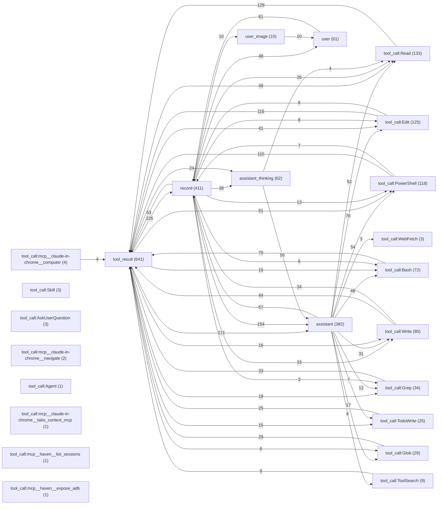

# D004 trajectory behavior graph

```mermaid
flowchart LR
    n_tool_result["tool_result (641)"]
    n_record["record (411)"]
    n_assistant["assistant (382)"]
    n_tool_call_Read["tool_call:Read (133)"]
    n_tool_call_Edit["tool_call:Edit (125)"]
    n_tool_call_PowerShell["tool_call:PowerShell (118)"]
    n_tool_call_Write["tool_call:Write (80)"]
    n_tool_call_Bash["tool_call:Bash (72)"]
    n_assistant_thinking["assistant_thinking (62)"]
    n_user["user (61)"]
    n_tool_call_Grep["tool_call:Grep (34)"]
    n_tool_call_Glob["tool_call:Glob (29)"]
    n_tool_call_TodoWrite["tool_call:TodoWrite (25)"]
    n_user_image["user_image (10)"]
    n_tool_call_ToolSearch["tool_call:ToolSearch (9)"]
    n_tool_call_mcp__claude_in_chrome__computer["tool_call:mcp__claude-in-chrome__computer (4)"]
    n_tool_call_WebFetch["tool_call:WebFetch (3)"]
    n_tool_call_Skill["tool_call:Skill (3)"]
    n_tool_call_AskUserQuestion["tool_call:AskUserQuestion (3)"]
    n_tool_call_mcp__claude_in_chrome__navigate["tool_call:mcp__claude-in-chrome__navigate (2)"]
    n_tool_call_Agent["tool_call:Agent (1)"]
    n_tool_call_mcp__claude_in_chrome__tabs_context_mcp["tool_call:mcp__claude-in-chrome__tabs_context_mcp (1)"]
    n_tool_call_mcp__haven__list_sessions["tool_call:mcp__haven__list_sessions (1)"]
    n_tool_call_mcp__haven__expose_adb["tool_call:mcp__haven__expose_adb (1)"]
    n_tool_result -->|225| n_record
    n_tool_result -->|171| n_assistant
    n_record -->|154| n_assistant
    n_tool_call_Read -->|129| n_tool_result
    n_tool_call_Edit -->|116| n_tool_result
    n_tool_call_PowerShell -->|110| n_tool_result
    n_assistant -->|76| n_tool_call_Edit
    n_tool_call_Bash -->|70| n_tool_result
    n_user -->|61| n_record
    n_assistant -->|57| n_record
    n_assistant_thinking -->|55| n_assistant
    n_assistant -->|54| n_tool_call_PowerShell
    n_record -->|53| n_tool_result
    n_assistant -->|52| n_tool_call_Read
    n_tool_result -->|51| n_tool_call_PowerShell
    n_record -->|48| n_user
    n_tool_result -->|48| n_tool_call_Read
    n_assistant -->|48| n_tool_call_Bash
    n_tool_call_Write -->|44| n_tool_result
    n_tool_result -->|41| n_tool_call_Edit
    n_record -->|38| n_assistant_thinking
    n_tool_call_Write -->|34| n_record
    n_record -->|33| n_tool_call_Write
    n_tool_call_Grep -->|33| n_tool_result
    n_assistant -->|31| n_tool_call_Write
    n_tool_call_Glob -->|29| n_tool_result
    n_record -->|26| n_tool_call_Read
    n_tool_call_TodoWrite -->|25| n_tool_result
    n_tool_result -->|24| n_assistant_thinking
    n_tool_result -->|18| n_tool_call_Grep
    n_assistant -->|17| n_tool_call_Glob
    n_tool_result -->|16| n_tool_call_Write
    n_tool_result -->|16| n_tool_call_Bash
    n_tool_result -->|15| n_tool_call_TodoWrite
    n_record -->|13| n_tool_call_PowerShell
    n_assistant -->|12| n_tool_call_Grep
    n_record -->|10| n_user_image
    n_user_image -->|10| n_user
    n_tool_call_ToolSearch -->|9| n_tool_result
    n_tool_result -->|8| n_tool_call_Glob
    n_tool_call_Edit -->|8| n_record
    n_record -->|8| n_tool_call_Edit
    n_assistant -->|8| n_tool_call_ToolSearch
    n_assistant -->|7| n_tool_call_TodoWrite
    n_tool_call_PowerShell -->|7| n_record
    n_record -->|6| n_tool_call_Bash
    n_assistant_thinking -->|4| n_tool_call_Read
    n_tool_call_mcp__claude_in_chrome__computer -->|4| n_tool_result
    n_record -->|3| n_tool_call_Grep
    n_assistant -->|3| n_tool_call_WebFetch
```

Slices: 29
Unique signatures: 29
