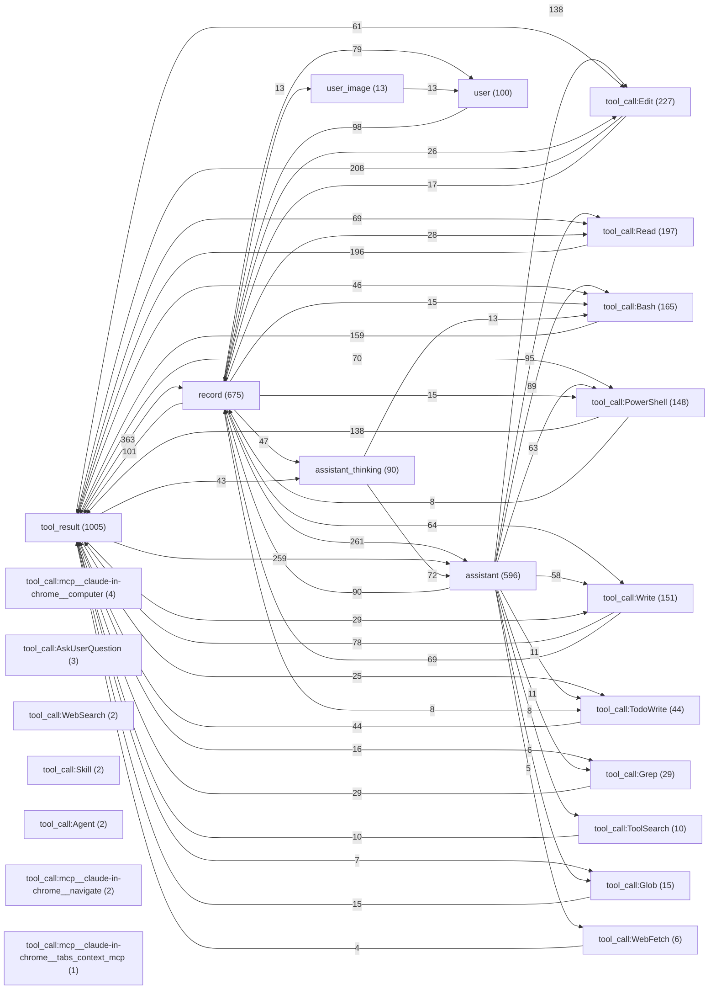

# D005 trajectory behavior graph

```mermaid
flowchart LR
    n_tool_result["tool_result (1005)"]
    n_record["record (675)"]
    n_assistant["assistant (596)"]
    n_tool_call_Edit["tool_call:Edit (227)"]
    n_tool_call_Read["tool_call:Read (197)"]
    n_tool_call_Bash["tool_call:Bash (165)"]
    n_tool_call_Write["tool_call:Write (151)"]
    n_tool_call_PowerShell["tool_call:PowerShell (148)"]
    n_user["user (100)"]
    n_assistant_thinking["assistant_thinking (90)"]
    n_tool_call_TodoWrite["tool_call:TodoWrite (44)"]
    n_tool_call_Grep["tool_call:Grep (29)"]
    n_tool_call_Glob["tool_call:Glob (15)"]
    n_user_image["user_image (13)"]
    n_tool_call_ToolSearch["tool_call:ToolSearch (10)"]
    n_tool_call_WebFetch["tool_call:WebFetch (6)"]
    n_tool_call_mcp__claude_in_chrome__computer["tool_call:mcp__claude-in-chrome__computer (4)"]
    n_tool_call_AskUserQuestion["tool_call:AskUserQuestion (3)"]
    n_tool_call_WebSearch["tool_call:WebSearch (2)"]
    n_tool_call_Skill["tool_call:Skill (2)"]
    n_tool_call_Agent["tool_call:Agent (2)"]
    n_tool_call_mcp__claude_in_chrome__navigate["tool_call:mcp__claude-in-chrome__navigate (2)"]
    n_tool_call_mcp__claude_in_chrome__tabs_context_mcp["tool_call:mcp__claude-in-chrome__tabs_context_mcp (1)"]
    n_tool_result -->|363| n_record
    n_record -->|261| n_assistant
    n_tool_result -->|259| n_assistant
    n_tool_call_Edit -->|208| n_tool_result
    n_tool_call_Read -->|196| n_tool_result
    n_tool_call_Bash -->|159| n_tool_result
    n_tool_call_PowerShell -->|138| n_tool_result
    n_assistant -->|138| n_tool_call_Edit
    n_record -->|101| n_tool_result
    n_user -->|98| n_record
    n_assistant -->|95| n_tool_call_Read
    n_assistant -->|90| n_record
    n_assistant -->|89| n_tool_call_Bash
    n_record -->|79| n_user
    n_tool_call_Write -->|78| n_tool_result
    n_assistant_thinking -->|72| n_assistant
    n_tool_result -->|70| n_tool_call_PowerShell
    n_tool_call_Write -->|69| n_record
    n_tool_result -->|69| n_tool_call_Read
    n_record -->|64| n_tool_call_Write
    n_assistant -->|63| n_tool_call_PowerShell
    n_tool_result -->|61| n_tool_call_Edit
    n_assistant -->|58| n_tool_call_Write
    n_record -->|47| n_assistant_thinking
    n_tool_result -->|46| n_tool_call_Bash
    n_tool_call_TodoWrite -->|44| n_tool_result
    n_tool_result -->|43| n_assistant_thinking
    n_tool_result -->|29| n_tool_call_Write
    n_tool_call_Grep -->|29| n_tool_result
    n_record -->|28| n_tool_call_Read
    n_record -->|26| n_tool_call_Edit
    n_tool_result -->|25| n_tool_call_TodoWrite
    n_tool_call_Edit -->|17| n_record
    n_tool_result -->|16| n_tool_call_Grep
    n_tool_call_Glob -->|15| n_tool_result
    n_record -->|15| n_tool_call_Bash
    n_record -->|15| n_tool_call_PowerShell
    n_record -->|13| n_user_image
    n_user_image -->|13| n_user
    n_assistant_thinking -->|13| n_tool_call_Bash
    n_assistant -->|11| n_tool_call_TodoWrite
    n_assistant -->|11| n_tool_call_Grep
    n_tool_call_ToolSearch -->|10| n_tool_result
    n_assistant -->|8| n_tool_call_ToolSearch
    n_record -->|8| n_tool_call_TodoWrite
    n_tool_call_PowerShell -->|8| n_record
    n_tool_result -->|7| n_tool_call_Glob
    n_assistant -->|6| n_tool_call_Glob
    n_assistant -->|5| n_tool_call_WebFetch
    n_tool_call_WebFetch -->|4| n_tool_result
```

Slices: 45
Unique signatures: 45
