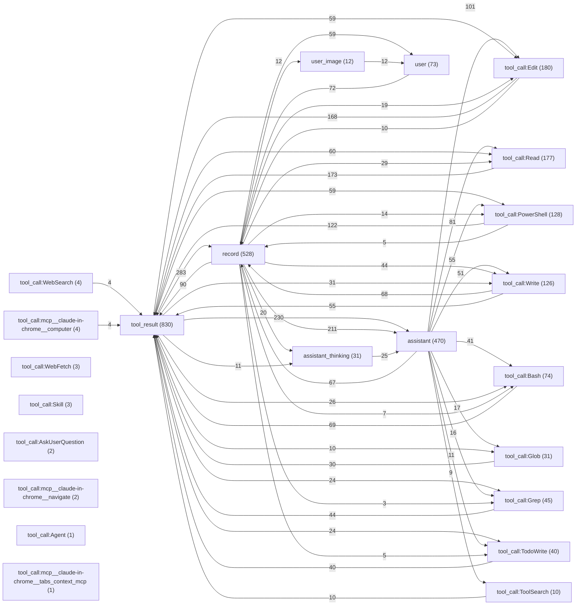

# D006 trajectory behavior graph

```mermaid
flowchart LR
    n_tool_result["tool_result (830)"]
    n_record["record (528)"]
    n_assistant["assistant (470)"]
    n_tool_call_Edit["tool_call:Edit (180)"]
    n_tool_call_Read["tool_call:Read (177)"]
    n_tool_call_PowerShell["tool_call:PowerShell (128)"]
    n_tool_call_Write["tool_call:Write (126)"]
    n_tool_call_Bash["tool_call:Bash (74)"]
    n_user["user (73)"]
    n_tool_call_Grep["tool_call:Grep (45)"]
    n_tool_call_TodoWrite["tool_call:TodoWrite (40)"]
    n_tool_call_Glob["tool_call:Glob (31)"]
    n_assistant_thinking["assistant_thinking (31)"]
    n_user_image["user_image (12)"]
    n_tool_call_ToolSearch["tool_call:ToolSearch (10)"]
    n_tool_call_WebSearch["tool_call:WebSearch (4)"]
    n_tool_call_mcp__claude_in_chrome__computer["tool_call:mcp__claude-in-chrome__computer (4)"]
    n_tool_call_WebFetch["tool_call:WebFetch (3)"]
    n_tool_call_Skill["tool_call:Skill (3)"]
    n_tool_call_AskUserQuestion["tool_call:AskUserQuestion (2)"]
    n_tool_call_mcp__claude_in_chrome__navigate["tool_call:mcp__claude-in-chrome__navigate (2)"]
    n_tool_call_Agent["tool_call:Agent (1)"]
    n_tool_call_mcp__claude_in_chrome__tabs_context_mcp["tool_call:mcp__claude-in-chrome__tabs_context_mcp (1)"]
    n_tool_result -->|283| n_record
    n_tool_result -->|230| n_assistant
    n_record -->|211| n_assistant
    n_tool_call_Read -->|173| n_tool_result
    n_tool_call_Edit -->|168| n_tool_result
    n_tool_call_PowerShell -->|122| n_tool_result
    n_assistant -->|101| n_tool_call_Edit
    n_record -->|90| n_tool_result
    n_assistant -->|81| n_tool_call_Read
    n_user -->|72| n_record
    n_tool_call_Bash -->|69| n_tool_result
    n_tool_call_Write -->|68| n_record
    n_assistant -->|67| n_record
    n_tool_result -->|60| n_tool_call_Read
    n_record -->|59| n_user
    n_tool_result -->|59| n_tool_call_PowerShell
    n_tool_result -->|59| n_tool_call_Edit
    n_assistant -->|55| n_tool_call_PowerShell
    n_tool_call_Write -->|55| n_tool_result
    n_assistant -->|51| n_tool_call_Write
    n_record -->|44| n_tool_call_Write
    n_tool_call_Grep -->|44| n_tool_result
    n_assistant -->|41| n_tool_call_Bash
    n_tool_call_TodoWrite -->|40| n_tool_result
    n_tool_result -->|31| n_tool_call_Write
    n_tool_call_Glob -->|30| n_tool_result
    n_record -->|29| n_tool_call_Read
    n_tool_result -->|26| n_tool_call_Bash
    n_assistant_thinking -->|25| n_assistant
    n_tool_result -->|24| n_tool_call_Grep
    n_tool_result -->|24| n_tool_call_TodoWrite
    n_record -->|20| n_assistant_thinking
    n_record -->|19| n_tool_call_Edit
    n_assistant -->|17| n_tool_call_Glob
    n_assistant -->|16| n_tool_call_Grep
    n_record -->|14| n_tool_call_PowerShell
    n_record -->|12| n_user_image
    n_user_image -->|12| n_user
    n_assistant -->|11| n_tool_call_TodoWrite
    n_tool_result -->|11| n_assistant_thinking
    n_tool_result -->|10| n_tool_call_Glob
    n_tool_call_Edit -->|10| n_record
    n_tool_call_ToolSearch -->|10| n_tool_result
    n_assistant -->|9| n_tool_call_ToolSearch
    n_record -->|7| n_tool_call_Bash
    n_tool_call_PowerShell -->|5| n_record
    n_record -->|5| n_tool_call_TodoWrite
    n_tool_call_WebSearch -->|4| n_tool_result
    n_tool_call_mcp__claude_in_chrome__computer -->|4| n_tool_result
    n_record -->|3| n_tool_call_Grep
```

Slices: 36
Unique signatures: 36
