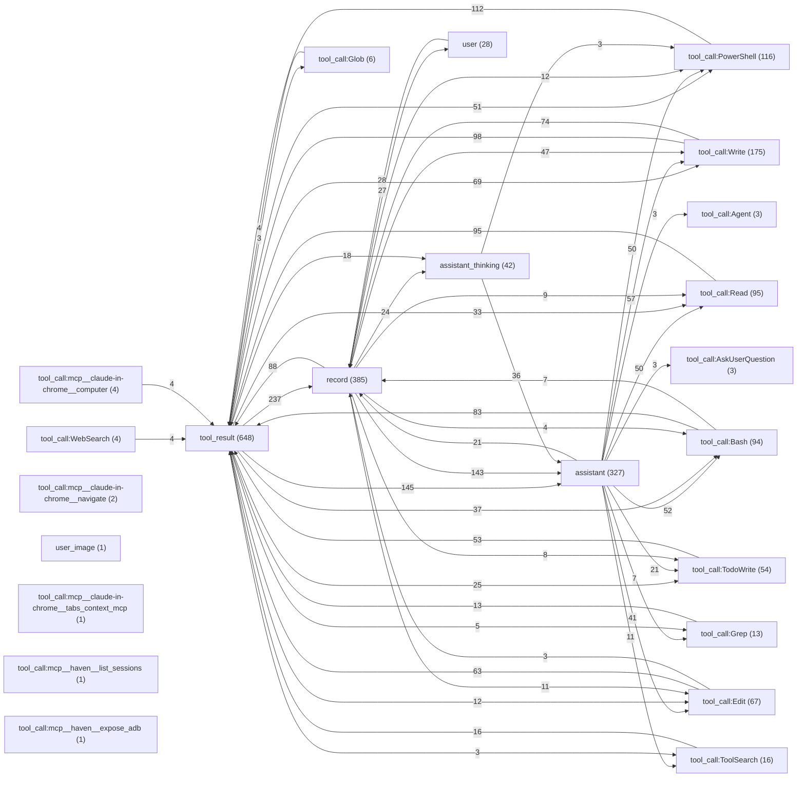

# D007 trajectory behavior graph

```mermaid
flowchart LR
    n_tool_result["tool_result (648)"]
    n_record["record (385)"]
    n_assistant["assistant (327)"]
    n_tool_call_Write["tool_call:Write (175)"]
    n_tool_call_PowerShell["tool_call:PowerShell (116)"]
    n_tool_call_Read["tool_call:Read (95)"]
    n_tool_call_Bash["tool_call:Bash (94)"]
    n_tool_call_Edit["tool_call:Edit (67)"]
    n_tool_call_TodoWrite["tool_call:TodoWrite (54)"]
    n_assistant_thinking["assistant_thinking (42)"]
    n_user["user (28)"]
    n_tool_call_ToolSearch["tool_call:ToolSearch (16)"]
    n_tool_call_Grep["tool_call:Grep (13)"]
    n_tool_call_Glob["tool_call:Glob (6)"]
    n_tool_call_WebSearch["tool_call:WebSearch (4)"]
    n_tool_call_mcp__claude_in_chrome__computer["tool_call:mcp__claude-in-chrome__computer (4)"]
    n_tool_call_Agent["tool_call:Agent (3)"]
    n_tool_call_AskUserQuestion["tool_call:AskUserQuestion (3)"]
    n_tool_call_mcp__claude_in_chrome__navigate["tool_call:mcp__claude-in-chrome__navigate (2)"]
    n_user_image["user_image (1)"]
    n_tool_call_mcp__claude_in_chrome__tabs_context_mcp["tool_call:mcp__claude-in-chrome__tabs_context_mcp (1)"]
    n_tool_call_mcp__haven__list_sessions["tool_call:mcp__haven__list_sessions (1)"]
    n_tool_call_mcp__haven__expose_adb["tool_call:mcp__haven__expose_adb (1)"]
    n_tool_result -->|237| n_record
    n_tool_result -->|145| n_assistant
    n_record -->|143| n_assistant
    n_tool_call_PowerShell -->|112| n_tool_result
    n_tool_call_Write -->|98| n_tool_result
    n_tool_call_Read -->|95| n_tool_result
    n_record -->|88| n_tool_result
    n_tool_call_Bash -->|83| n_tool_result
    n_tool_call_Write -->|74| n_record
    n_tool_result -->|69| n_tool_call_Write
    n_tool_call_Edit -->|63| n_tool_result
    n_assistant -->|57| n_tool_call_Write
    n_tool_call_TodoWrite -->|53| n_tool_result
    n_assistant -->|52| n_tool_call_Bash
    n_tool_result -->|51| n_tool_call_PowerShell
    n_assistant -->|50| n_tool_call_PowerShell
    n_assistant -->|50| n_tool_call_Read
    n_record -->|47| n_tool_call_Write
    n_assistant -->|41| n_tool_call_Edit
    n_tool_result -->|37| n_tool_call_Bash
    n_assistant_thinking -->|36| n_assistant
    n_tool_result -->|33| n_tool_call_Read
    n_user -->|28| n_record
    n_record -->|27| n_user
    n_tool_result -->|25| n_tool_call_TodoWrite
    n_record -->|24| n_assistant_thinking
    n_assistant -->|21| n_record
    n_assistant -->|21| n_tool_call_TodoWrite
    n_tool_result -->|18| n_assistant_thinking
    n_tool_call_ToolSearch -->|16| n_tool_result
    n_tool_call_Grep -->|13| n_tool_result
    n_tool_result -->|12| n_tool_call_Edit
    n_record -->|12| n_tool_call_PowerShell
    n_assistant -->|11| n_tool_call_ToolSearch
    n_record -->|11| n_tool_call_Edit
    n_record -->|9| n_tool_call_Read
    n_record -->|8| n_tool_call_TodoWrite
    n_tool_call_Bash -->|7| n_record
    n_assistant -->|7| n_tool_call_Grep
    n_tool_result -->|5| n_tool_call_Grep
    n_record -->|4| n_tool_call_Bash
    n_tool_call_Glob -->|4| n_tool_result
    n_tool_call_WebSearch -->|4| n_tool_result
    n_tool_call_mcp__claude_in_chrome__computer -->|4| n_tool_result
    n_assistant -->|3| n_tool_call_Agent
    n_tool_call_Edit -->|3| n_record
    n_tool_result -->|3| n_tool_call_Glob
    n_assistant_thinking -->|3| n_tool_call_PowerShell
    n_tool_result -->|3| n_tool_call_ToolSearch
    n_assistant -->|3| n_tool_call_AskUserQuestion
```

Slices: 27
Unique signatures: 27
