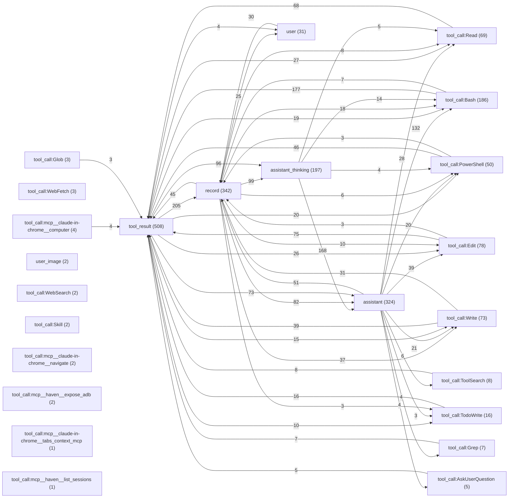

# D008 trajectory behavior graph

```mermaid
flowchart LR
    n_tool_result["tool_result (508)"]
    n_record["record (342)"]
    n_assistant["assistant (324)"]
    n_assistant_thinking["assistant_thinking (197)"]
    n_tool_call_Bash["tool_call:Bash (186)"]
    n_tool_call_Edit["tool_call:Edit (78)"]
    n_tool_call_Write["tool_call:Write (73)"]
    n_tool_call_Read["tool_call:Read (69)"]
    n_tool_call_PowerShell["tool_call:PowerShell (50)"]
    n_user["user (31)"]
    n_tool_call_TodoWrite["tool_call:TodoWrite (16)"]
    n_tool_call_ToolSearch["tool_call:ToolSearch (8)"]
    n_tool_call_Grep["tool_call:Grep (7)"]
    n_tool_call_AskUserQuestion["tool_call:AskUserQuestion (5)"]
    n_tool_call_mcp__claude_in_chrome__computer["tool_call:mcp__claude-in-chrome__computer (4)"]
    n_tool_call_WebFetch["tool_call:WebFetch (3)"]
    n_tool_call_Glob["tool_call:Glob (3)"]
    n_user_image["user_image (2)"]
    n_tool_call_WebSearch["tool_call:WebSearch (2)"]
    n_tool_call_Skill["tool_call:Skill (2)"]
    n_tool_call_mcp__claude_in_chrome__navigate["tool_call:mcp__claude-in-chrome__navigate (2)"]
    n_tool_call_mcp__haven__expose_adb["tool_call:mcp__haven__expose_adb (2)"]
    n_tool_call_mcp__claude_in_chrome__tabs_context_mcp["tool_call:mcp__claude-in-chrome__tabs_context_mcp (1)"]
    n_tool_call_mcp__haven__list_sessions["tool_call:mcp__haven__list_sessions (1)"]
    n_tool_result -->|205| n_record
    n_tool_call_Bash -->|177| n_tool_result
    n_assistant_thinking -->|168| n_assistant
    n_assistant -->|132| n_tool_call_Bash
    n_record -->|99| n_assistant_thinking
    n_tool_result -->|96| n_assistant_thinking
    n_record -->|82| n_assistant
    n_tool_call_Edit -->|75| n_tool_result
    n_tool_result -->|73| n_assistant
    n_tool_call_Read -->|68| n_tool_result
    n_assistant -->|51| n_record
    n_tool_call_PowerShell -->|46| n_tool_result
    n_record -->|45| n_tool_result
    n_assistant -->|39| n_tool_call_Edit
    n_tool_call_Write -->|39| n_tool_result
    n_record -->|37| n_tool_call_Write
    n_tool_call_Write -->|31| n_record
    n_user -->|30| n_record
    n_assistant -->|28| n_tool_call_Read
    n_tool_result -->|27| n_tool_call_Read
    n_tool_result -->|26| n_tool_call_Edit
    n_record -->|25| n_user
    n_assistant -->|21| n_tool_call_Write
    n_tool_result -->|20| n_tool_call_PowerShell
    n_assistant -->|20| n_tool_call_PowerShell
    n_tool_result -->|19| n_tool_call_Bash
    n_record -->|18| n_tool_call_Bash
    n_tool_call_TodoWrite -->|16| n_tool_result
    n_tool_result -->|15| n_tool_call_Write
    n_assistant_thinking -->|14| n_tool_call_Bash
    n_record -->|10| n_tool_call_Edit
    n_tool_result -->|10| n_tool_call_TodoWrite
    n_tool_call_ToolSearch -->|8| n_tool_result
    n_record -->|8| n_tool_call_Read
    n_tool_call_Grep -->|7| n_tool_result
    n_tool_call_Bash -->|7| n_record
    n_assistant -->|6| n_tool_call_ToolSearch
    n_record -->|6| n_tool_call_PowerShell
    n_assistant_thinking -->|5| n_tool_call_Read
    n_tool_call_AskUserQuestion -->|5| n_tool_result
    n_assistant -->|4| n_tool_call_Grep
    n_tool_result -->|4| n_user
    n_assistant_thinking -->|4| n_tool_call_PowerShell
    n_assistant -->|4| n_tool_call_AskUserQuestion
    n_tool_call_mcp__claude_in_chrome__computer -->|4| n_tool_result
    n_tool_call_Edit -->|3| n_record
    n_tool_call_PowerShell -->|3| n_record
    n_tool_call_Glob -->|3| n_tool_result
    n_assistant -->|3| n_tool_call_TodoWrite
    n_record -->|3| n_tool_call_TodoWrite
```

Slices: 24
Unique signatures: 23
