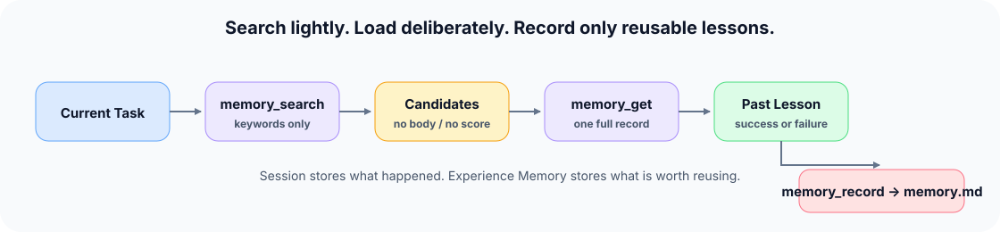
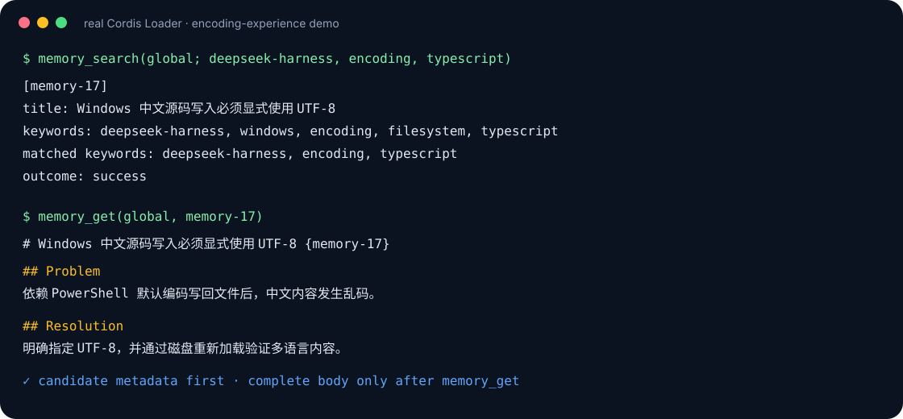
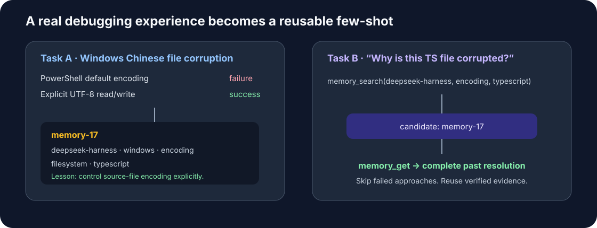
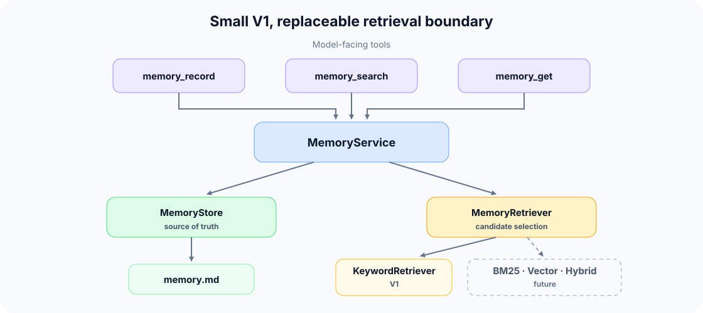

# dsh-memory

[English](README.md) | 中文

**Session 保存发生过什么；Experience Memory 保存值得复用什么。**

`@deepseek-ai/dsh-memory` 是 DeepSeek Harness 的追加式经验记忆插件。它把可复用的成功与失败提炼成独立 Markdown 记录，而不是保存对话或重建完整 Session。它还提供按 cwd 隔离的事实记忆：关于用户或工作空间的稳定事实会在每一轮自动注入模型上下文。



模型先搜索轻量候选元数据，只显式加载值得使用的经验；仅当当前任务产生了可复用结论时，才记录一条新经验。

## 查看真实运行

下面的终端记录来自仓库内通过[真实 Cordis Loader 运行的 Demo](examples/encoding-experience/demo.ts)，使用的插件、工具、Prompt 注册、Parser 和 Retriever 均与正式实现相同。



在仓库根目录运行：

```powershell
pnpm exec tsx packages/memory/memory/examples/encoding-experience/demo.ts
```

完整示例包含真实的 [`cordis.yml`](examples/encoding-experience/cordis.yml) 和预置 [`memory.md`](examples/encoding-experience/memory.md)。

## 为什么需要 Experience Memory？

| 系统 | 保存内容 | 最适合 | 主要代价 |
|---|---|---|---|
| Session 历史/搜索 | 完整交互与事件 | 审计、回放、恢复 | 作为可复用 Prompt 时体积大、噪声多 |
| 通用 RAG Memory | 从广泛语料检索出的 Chunk | 查找可能相关的信息 | Chunk 不一定是经过验证的经验 |
| Experience Memory | 提炼后的成功/失败记录 | 复用已验证的调试和任务经验 | 需要有意识地提炼经验 |

Experience Memory 是 Session 存储的补充。Session 数据保留完整历史证据；`memory.md` 只保存被选中供未来复用的紧凑经验。

## 一个真实的 UTF-8 调试案例

本插件源于反复出现的 Windows 编码故障：通过隐式默认编码写入包含中文的 TypeScript 或 Markdown 文件，会破坏源码。失败方案及最终成功的 UTF-8 解决方法被整理成了一条可复用经验。



持久记录就是普通 Markdown：

```markdown
# Windows 中文源码写入必须显式使用 UTF-8 {memory-17}

Keywords: deepseek-harness, windows, encoding, filesystem, typescript
Recorded At: 2026-08-16T02:34:23.123Z
Outcome: success

## Problem

依赖 PowerShell 默认编码写回文件后，中文内容发生乱码。

## Resolution

读写包含非 ASCII 内容的文件时显式使用 UTF-8，并通过磁盘重新加载验证内容。

## Lesson

跨平台文本修改必须控制源文件编码，并用真实多语言内容做 round-trip 回归。
```

后续任务搜索时不加载所有正文：

```text
[memory-17]
title: Windows 中文源码写入必须显式使用 UTF-8
keywords: deepseek-harness, windows, encoding, filesystem, typescript
matched keywords: deepseek-harness, encoding, typescript
outcome: success
```

只有 `memory_get("memory-17")` 才会把完整经验加入模型上下文。

## 安装与配置

在 DeepSeek Harness Workspace 中添加该包：

```powershell
pnpm add @deepseek-ai/dsh-memory
```

在 System Prompt 和 Tool 服务之后加载插件：

```yaml
- name: '@deepseek-ai/dsh-system-prompt'
- name: '@deepseek-ai/dsh-tools'
- name: '@deepseek-ai/dsh-memory'
  config:
    memoryFile: 'C:/Users/you/.dsh/memory.md'
```

`memoryFile` 默认为 `$DSH_HOME/memory.md`。该路径由 Host 所有，模型不能选择 Workspace 文件。第一次成功调用 `memory_record` 时，会自动创建父目录和文件。

事实记忆按绝对 cwd 存储在 `factsDir` 下（默认为 `$DSH_HOME/memory-facts`），每个 cwd 一个 Markdown 文件，文件名是该绝对路径的短 SHA-256 摘要。`maxFacts` 限制每个 cwd 注入到系统提示中的事实数量（默认 `100`）。

## 事实记忆（按 cwd 隔离的长期记忆）

与经验记忆不同，事实从不被搜索：`fact_remember` 和 `fact_forget` 维护一个以绝对会话工作目录为作用域的键值存储，当前 cwd 的每条事实都会在每次装配时自动注入系统提示。

```text
user says "我叫 gan" or asks to remember the name
  → fact_remember({ key: 'user name', value: 'gan' })
  → persisted to <factsDir>/<sha256(cwd)>.md
  → injected every turn as "user name: gan" for this cwd only
```

- 隔离按绝对 cwd：在 `D:/project-a` 保存的事实永远不会出现在 `D:/project-b`，也不会出现在大小写或分隔符不同但语义相同的路径上。
- 键会被去空格并转小写；`fact_remember` 是 upsert，同一键的后续值会替换旧值。
- 注入区块指导模型把这些事实视为已知、当前的事实（除非用户反驳），并主动记住稳定的个人或项目事实，在用户更正或撤销时删除对应事实。
- 注入是 `system-prompt/assemble` 的动态贡献，因此事实每轮都会出现，并且 `fact_remember` 或 `fact_forget` 调用后会立即更新，无需重启。

## 模型工具

### `memory_search`

接收具体关键词与可选 limit，返回 `id`、标题、规范化关键词、匹配关键词和 outcome，绝不返回正文或内部 Ranking Score。

### `memory_get`

通过稳定的 `memory-N` ID 加载一条完整记录。ID 不存在时返回明确、模型可读的提示。

### `memory_record`

校验并直接持久化模型 Tool Call 提交的字段。Harness 生成 ID 和 ISO 8601 `recordedAt`；缺省 outcome 变为 `unknown`。当前没有用户确认步骤。

```text
model Tool Call
  → validate title, keywords, body, outcome
  → normalize keywords
  → serialize the write
  → reload memory.md and allocate max(memory-N) + 1
  → atomic replace
```

空标题、正文或关键词列表会被拒绝。正文允许 `##` 到 `######` Heading，但禁止一级 Heading，因为只有 `# <title> {memory-N}` 才能定义 Record Boundary。

### `fact_remember`

为当前会话 cwd 保存一条键值事实。空键或空值会被拒绝；键在持久化前去空格并转小写。

### `fact_forget`

按键删除当前会话 cwd 的一条已保存事实。键不存在时返回明确、模型可读的提示，而不是报错。

## 架构



`MemoryStore` 拥有 Markdown 唯一事实源，`MemoryRetriever` 拥有候选筛选职责。V1 的 `KeywordRetriever` 使用规范化关键词精确交集与线性扫描。

内部匹配关键词数量只用于选出 Top-K。入选候选随后按 `memory-N` 升序展示，因此展示顺序不表达相关性。面向模型的输出永不暴露 `score`、`rankingScore` 或 `similarity`。

`MemoryRetriever` 接收 `MemorySearchSource`。未来 BM25、Vector 或 Hybrid Provider 可以维护派生 Index，而不用改变 Store、Service 或模型工具。这些是扩展点，不是 V1 功能。

`FactStore` 拥有按 cwd 的事实文件；`FactSource` 是它面向系统提示注入的只读投影。`MemoryService` 同时暴露两个 Store，是所有工具的唯一入口。

## 持久化与并发

- 每次读取和每次 Append 内都会重新加载 `memory.md`，因此可以看到外部编辑。
- 写入采用原子替换，并设置仅 Owner 可访问的文件与目录权限。
- 进程内串行队列覆盖重新加载、ID 分配和写入。同一进程内的并发 Session 不会产生重复 ID 或丢失 Append。
- 不支持多个进程并发写入同一个文件。
- 每个 cwd 的事实文件有自己的串行写队列，因此同一 cwd 上并发的 `fact_remember` 不会丢失事实；`fact_forget` 清空存储时会删除该文件。

## 验证

面向发布的测试覆盖：

- 空、单条、多条、损坏及嵌套 Heading 的 Markdown 记录；
- 最大 ID 分配、缺失文件创建、外部修改重载和 Batch 原子拒绝；
- 三条并发 Append，不重复 ID、不丢失内容；
- 关键词精确匹配、规范化、零匹配、limit 以及 Top-K 选择与展示分离；
- Tool 输出契约，包括 Search 不泄露正文或 Score；
- 事实 round-trip、并发 remember、按 cwd 隔离以及注入 Section 渲染；
- 真实 Cordis Loader 装配及完整 `record → search → get` Tool 执行；
- 插件卸载后清理 Tool、Service 和 System Prompt Section；
- 多语言 UTF-8 round-trip，包含中文、English、日本語、Emoji、Markdown、代码片段和中文 Windows 路径。

运行命令：

```powershell
pnpm exec vitest run packages/memory/memory/tests
pnpm exec tsc -p packages/memory/memory/tsconfig.json --noEmit
```

覆盖率百分比是诊断指标而不是发布定义；产品契约和可复现的集成行为才是验收标准。

## 模型指导与 Token 行为

插件指导模型生成多个具体搜索关键词，把搜索结果视为候选而不是真相，只显式加载值得读取的记录，并且只记录可复用经验，而不是普通错误或完整 Session 历史。它还指导模型把注入的按 cwd 事实视为已知上下文，用 `fact_remember` 保存稳定的个人或项目事实，并用 `fact_forget` 删除被更正或撤销的事实。

插件可见性不变时，Tool Schema 和固定指导保持 Prefix Stable。搜索成本随轻量候选元数据增长；只有显式调用 `memory_get` 才会把完整正文 Token 加入上下文。注入的事实每个 cwd 每轮最多增加 `maxFacts` 行简短的 `key: value`。

## 已知限制与路线图

- 经验记忆是进程全局、仅精确关键词检索；没有项目根 Scope、BM25、Embedding、Vector、Reranking 或 Hybrid Retrieval。事实记忆仅按 cwd 隔离——不会随项目进入其子目录。
- 没有自动 Session 挖掘、迁移、删除、合并、语义去重、矛盾处理或衰减。
- 写队列只保护单个进程。
- 事实键按设计不区分大小写（去空格并转小写），所以 `User Name` 与 `user name` 是同一条事实。
- 性能 Benchmark 和大语料检索评估推迟到真实使用证明当前线性扫描假设失效之后。
